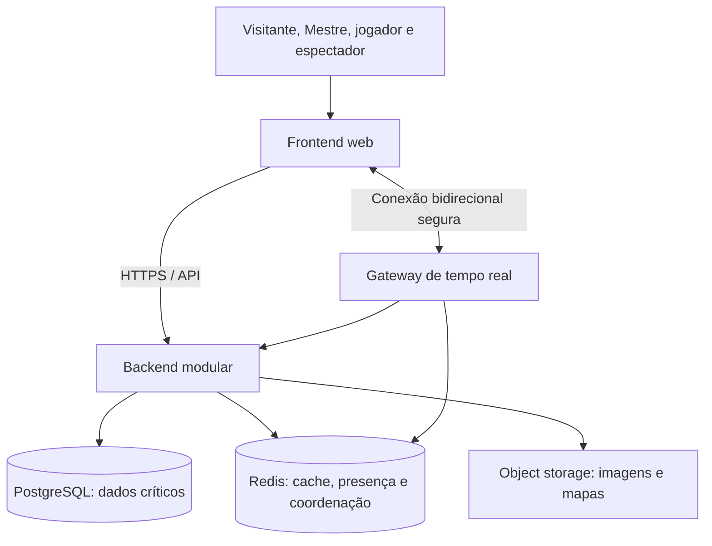

# 07 — Arquitetura

## Direção recomendada

A origem recomenda frontend Next.js, backend NestJS, PostgreSQL, Redis e armazenamento de objetos. A primeira etapa adotou um **monólito modular no backend**, separado do frontend, com contratos compartilhados; veja a [decisão 001](architecture/decisions/001-base-e-autenticacao.md). O diagrama completo abaixo permanece o alvo de evolução: Redis ainda não foi implementado. Avatares já usam Blob no ambiente Vercel de testes, conforme o [procedimento de deploy](deploy-vercel.md).

O objetivo é manter regras de negócio e autorização no servidor, dados críticos em banco e definições de RPG configuráveis. Separar módulos não exige criar um serviço por módulo.

O módulo `systems` já persiste definições JSON validadas e versões imutáveis, com autorização por autor e controle de revisão concorrente. A [decisão 002](architecture/decisions/002-sistemas-versionados.md) registra essa adoção da DP06. O módulo `campaigns` mantém mestre, versão fixa, configuração, apresentação pública/privada e histórico transacional conforme a [decisão 003](architecture/decisions/003-campanhas-versionadas.md). Inclui o serviço/controlador de convites e membros da [decisão 004](architecture/decisions/004-convites-e-membros.md): vínculos explícitos no PostgreSQL, autorização compartilhada por campanha e bloqueio de linha comum às mutações de lotação. A interface consulta convites/membros ao recuperar foco e a cada 30 segundos enquanto visível. Fichas e transporte de tempo real continuam futuros.



O diagrama é lógico. Proxy, balanceador, TLS e topologia de implantação dependem do provedor escolhido.

## Stack sugerida na origem

| Camada | Sugestão | Responsabilidade |
| --- | --- | --- |
| Frontend | Next.js, React, TypeScript, Tailwind CSS | Rotas, interface responsiva, editor e sala |
| Estado/consultas/formulários | Zustand, TanStack Query, React Hook Form, Zod | Bibliotecas possíveis; adotar apenas quando houver necessidade |
| Backend | Node.js, NestJS, TypeScript | API, aplicação de regras, autenticação e autorização |
| Banco | PostgreSQL; Prisma como ORM possível | Integridade e persistência transacional |
| Tempo real | Socket.IO ou WebSocket puro | Eventos bidirecionais; escolha pendente |
| Coordenação | Redis | Presença, cache, fan-out e futuras filas |
| Arquivos | Object storage | Avatares, banners e, em etapas futuras, mapas |

Versões adotadas e escolhas de ambiente local estão registradas na decisão 001 e no lockfile. Fornecedor de storage e forma de implantação de produção continuam pendentes.

## Fronteiras dos módulos

| Módulo | Responsabilidade | Etapa |
| --- | --- | --- |
| auth | Cadastro, login, refresh, logout e credenciais | MVP 1 |
| users / profiles | Identidade e perfil público | MVP 1 |
| systems | Definições visuais e publicação de sistemas | MVP 1 |
| campaigns | Campanhas e suas configurações | MVP 1 |
| members / invitations | Vínculos, convites e remoção | MVP 1; solicitações depois |
| characters | Fichas e validação contra o sistema | MVP 1 |
| sessions | Agenda, estado, participantes e acesso de espectador | MVP 1 |
| chat | Mensagens e histórico autorizados | MVP 1 |
| dice | Parser, cálculo e histórico | MVP 1 |
| maps / inventory / npcs / combat | Conteúdo e ferramentas da mesa | MVP 2 |
| documents / journal | Conhecimento e registros de campanha | MVP 3 |
| notifications | Avisos; no MVP, consulta de convites pode bastar | Escopo incremental |

Autorização é compartilhada, mas as políticas dependem do recurso e do vínculo da campanha. Controller HTTP e gateway de tempo real devem chamar os mesmos serviços de aplicação, evitando duas versões da regra.

## Fluxo de uma mutação

1. Identificar usuário pela credencial verificada.
2. Carregar recurso e contexto de campanha/sistema.
3. Aplicar política de acesso e validar estado e entrada.
4. Persistir com transação quando houver múltiplas mudanças dependentes.
5. Registrar auditoria administrativa quando aplicável.
6. Publicar a projeção do evento aos destinatários autorizados.

Proposta de consistência: nunca transmitir uma alteração que ainda não foi confirmada no banco. Falha após a confirmação pode exigir recuperação por consulta; uma outbox transacional é opção posterior para entrega durável, sem ser requisito imposto ao MVP.

## Personalização do sistema

Usar identificadores estáveis para campos definidos pelo usuário e separar chave técnica de rótulo. Renomear “Força” não deve apagar valores armazenados.

Evitar colunas fixas como `strength` ou `mana` no personagem como única estrutura possível. Atributos, perícias, recursos e seus valores dependem da definição do sistema; o [modelo de dados](08-modelo-de-dados.md) propõe relações e campos flexíveis validados.

Para fórmulas futuras, propor uma linguagem limitada com parser próprio, operadores permitidos e referências explícitas a campos. Detectar ciclos, limitar custo e nunca executar JavaScript ou código arbitrário do criador. Gramática, arredondamento, cartas e demais mecanismos estão em DP12.

## Escalabilidade e tempo real

- Backend não deve depender da memória de uma única instância para autorização, histórico ou estado crítico.
- Redis pode distribuir eventos e presença entre instâncias; o banco permanece fonte de verdade.
- Se Socket.IO usar long polling em múltiplas instâncias, definir afinidade de sessão no balanceador; o adapter Redis não resolve essa necessidade sozinho.
- Contadores de presença têm natureza transitória e devem expirar; vínculos de campanha e participantes persistidos não dependem deles.
- Reconexão deve revalidar acesso e recuperar snapshot/histórico, em vez de assumir que todos os eventos chegaram.

## Estrutura proposta do repositório

```text
rpg-platform/
  apps/
    web/src/
      app/
      components/
      features/{auth,profile,systems,campaigns,characters,sessions,chat,map,combat}/
      hooks/
      services/
      store/
      types/
      utils/
    api/src/
      modules/
      common/
      database/
      guards/
      interceptors/
      decorators/
      websocket/
  packages/
    ui/
    types/
    validation/
    config/
  docs/
  docker/
  scripts/
```

Diretórios de funcionalidades futuras só precisam ser criados quando tiverem implementação. `packages/validation` pode compartilhar formas de dados; o servidor sempre valida novamente. `packages/types` não deve expor modelos internos com campos secretos ao frontend.

## Registro de decisões

Antes de implementar, registrar stack e versões (DP01), versionamento do sistema (DP06), estratégia de concorrência das fichas, transporte de tempo real e transporte de tokens (DP03). Decisões técnicas relevantes devem usar registro com contexto, alternativas, escolha e consequências conforme [contribuição](18-contribuicao.md).

## Referências

Origem: seções 34–44 e 56. Veja [API](09-api.md), [WebSocket](10-websocket.md) e [deploy](17-deploy.md).
