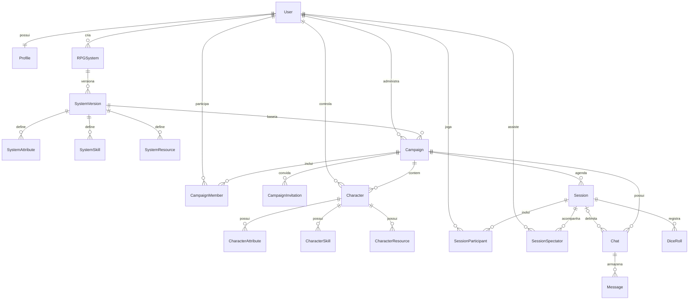

# 08 — Modelo de dados

Este é um modelo **conceitual e lógico proposto**, derivado das entidades das seções 40–41. Não é uma migration, um schema Prisma ou uma decisão definitiva de armazenamento. Campos, enums e restrições devem ser validados junto da implementação.

`User`, `Profile`, `RefreshSession`, `RpgSystem`, `SystemVersion`, `Campaign`, `CampaignChange`, `CampaignMember`, `CampaignInvitation`, `Character`, `CharacterChange`, `GameSession`, `GameSessionChange` e `DiceRoll` já possuem [schema Prisma](../apps/api/prisma/schema.prisma) e migrations versionadas. As demais entidades abaixo continuam propostas para os próximos módulos.

## Recorte implementado de sistemas

`RpgSystem` armazena autor (`ownerId`), nome, descrição, visibilidade e revisão atual. `SystemVersion` armazena um snapshot imutável de nome, descrição e definição JSON, com unicidade `(systemId, number)`. A criação e cada atualização gravam sistema/versão na mesma transação; atualização exige a revisão esperada. Há índices por autor/data e visibilidade/data.

A definição JSON inclui `schemaVersion: 1`, atributos, perícias, recursos e dados. Campos usam UUIDs estáveis gerados pelo editor, preservados entre versões; a ordem das listas é a ordem de apresentação. Perícias podem referenciar atributos da mesma definição, e recursos podem ter máximo nulo. Schemas estritos rejeitam duplicatas, referências inválidas e limites inconsistentes. Não existem tabelas separadas `SystemAttribute`, `SystemSkill` ou `SystemResource` neste recorte.

A [decisão 002](architecture/decisions/002-sistemas-versionados.md) registra visibilidade, limites e versionamento. Campanhas já apontam para `SystemVersion.id`, sem mudar as regras vinculadas quando o criador salvar novas versões.

## Recorte implementado de campanhas

`Campaign` armazena mestre (`ownerId`), versão fixa (`systemVersionId`), nome, descrição, visibilidade pública/privada, estado, capacidade de jogadores, revisão e datas. A versão deve pertencer a um sistema criado pelo mestre; não pode ser alterada pela API. A chave estrangeira impede remover uma versão referenciada. Índices cobrem mestre/atualização, visibilidade/atualização e versão.

`CampaignChange` registra revisão única por campanha, ator, snapshot da configuração e data. Criação/edição e histórico usam a mesma transação, com controle otimista de concorrência. O banco também limita capacidade a 1–20 e revisão positiva. Definição do sistema e histórico não são enviados no DTO público. Responsabilidade usa `ownerId`. A [decisão 003](architecture/decisions/003-campanhas-versionadas.md) registra os limites.

## Recorte implementado de convites e membros

`CampaignMember` representa somente jogadores: id, campaignId, userId, status ACTIVE/REMOVED, joinedAt, removedAt e updatedAt. O par campanha/usuário é único; índices cobrem usuário/estado e campanha/estado. O mestre é derivado de `Campaign.ownerId`, exibido no DTO sem duplicar seu vínculo. Reingresso reutiliza a linha e atualiza joinedAt.

`CampaignInvitation` armazena campanha, remetente/destinatário por FK, estado, createdAt, expiresAt e respondedAt. Índices cobrem destinatário/data e campanha/data. Um índice único parcial na migration SQL limita PENDING por campanha/destinatário; não está expresso no schema Prisma. Vencimento também é calculado no DTO, sem job obrigatório. As FKs usam cascata; a API não oferece exclusão de conta/campanha neste recorte.

Aceite, revogação, remoção e edição de capacidade bloqueiam a mesma linha de campanha na transação. Capacidade conta apenas jogadores ativos e não reserva convites. A [decisão 004](architecture/decisions/004-convites-e-membros.md) registra estados, idempotência, acesso e limites; não há tabela separada de permissões individuais ou auditoria completa de vínculos.

## Recorte implementado de personagens

`Character` armazena dono, campanha, versão fixa, nome, descrição, história, nível opcional, values JSON, revisão e datas. A FK composta para `(Campaign.id, Campaign.systemVersionId)` garante a mesma versão. Índices cobrem dono/atualização, campanha/atualização e versão. CHECKs limitam nível e revisão. A aplicação valida UUIDs/categorias exatos, valores inteiros e limites de recursos da definição imutável.

`CharacterChange` registra ator, revisão única por personagem, snapshot e data na mesma transação da gravação. Não há tabelas CharacterAttribute/CharacterSkill/CharacterResource separadas neste recorte. Remoção do membro conserva o personagem e seu histórico; leitura depende de vínculo ativo ou responsabilidade da campanha. Criação/edição usa a mesma trava da campanha que a remoção. Políticas na [decisão 005](architecture/decisions/005-personagens-e-fichas.md).

## Recorte implementado de sessões

GameSession armazena campaignId, título, descrição, scheduledAt UTC, timeZone IANA, visibilidade, estado SCHEDULED/LIVE/ENDED/CANCELLED, revisão, startedAt/endedAt/cancelledAt, durationSeconds e criação/atualização. Mestre deriva da campanha. Índices cobrem campanha/agenda e estado/visibilidade/início. CHECKs protegem revisão e coerência de estado/datas/duração; índice SQL parcial GameSession_one_live_per_campaign limita LIVE por campanha.

GameSessionChange guarda sessão, ator, revisão única, snapshot e data junto da escrita. Migration aditiva 20261008010000_sessions. Não há SessionParticipant/SessionSpectator: acesso privado deriva de mestre ou jogador ativo da campanha, sem seleção ou presença. [Decisão 006](architecture/decisions/006-sessoes-e-agenda.md). O diagrama completo abaixo permanece conceitual.

## Recorte implementado de rolagens

DiceRoll armazena sessão por FK, sequência crescente por encontro, actorId autenticado, requestId e payload normalizado, snapshots de autor e ficha/campo, count/sides, modificadores adicional/da ficha/final, resultados inteiros, total e createdAt. Unicidades por sessão/sequência e sessão/ator/tentativa. CHECKs limitam quantidade/faces/modificadores e garantem total exato com a função SQL imutável dice_roll_sum. Índice de sequência atende consultas por cursor. Não há expressão livre, seleção kh ou FK da ficha no recorte atual.

Migration aditiva 20261008020000_dice_rolls; nenhum registro anterior é alterado. Snapshots preservam nomes/valores/revisão do instante da rolagem. FK de sessão usa cascata, e não há API de exclusão. Autorização vem da campanha, revalidada antes de ler ou recuperar tentativas; novas escritas compartilham a trava de Campaign. [Decisão 007](architecture/decisions/007-rolagens-e-historico.md).

## Recorte implementado de conquistas e cosméticos

Catálogo versionado em código, quatro condições binárias. UserAchievement (userId/achievementId únicos, earnedAt, ruleVersion) e UserCosmetic (userId/cosmeticId únicos, earnedAt), ambas por FK de conta com cascata. Profile guarda backgroundId/avatarFrameId opcionais; FKs compostas limitam aos itens da conta e CHECKs validam categoria. Concessão na mesma transação da ação; sem eventos/contadores neste recorte. Migration 20261008030000_achievement_cosmetics inclui retroatividade de fatos existentes e mantém seleção nula. [Decisão 008](architecture/decisions/008-conquistas-e-cosmeticos.md).

## Convenções propostas

- IDs opacos, estáveis e gerados pelo servidor; timestamps UTC.
- `createdAt` e `updatedAt` para recursos mutáveis; autor/responsável explícito.
- Chaves estrangeiras para relações; restrições únicas para vínculos e identificadores.
- Dados flexíveis de RPG são validados contra uma definição versionada.
- JSON pode armazenar configurações variáveis; relações de autorização, autoria e participação permanecem explícitas.
- Exclusão física, arquivamento e retenção dependem de DP08; evitar cascatas irreversíveis sem política.

## Relações do núcleo

`SystemVersion` e `CharacterResource` são acréscimos derivados para explicitar versionamento e recursos, não entidades nomeadas na lista original; `SystemVersion` já foi adotada no recorte acima. O vínculo de `Chat` com `Session` é opcional para suportar chat geral de campanha futuramente.

## Entidades do MVP 1

| Entidade | Campos propostos principais | Restrições e observações |
| --- | --- | --- |
| User | id, identificador de login, username, passwordHash, status | Login único conforme DP02; hash nunca vai em DTO público |
| Profile | userId, nome, biografia, avatarKey, bannerKey, localização opcional, links | Relação 1:1; perfil público filtra informações privadas |
| RPGSystem | id, creatorId, nome, descrição, temática, visibilidade | Criador e acesso explícitos; regras futuras podem ser conteúdo estruturado |
| SystemVersion | id, systemId, número, definição, publishedAt | Versão imutável adotada; campos reais e vínculo de campanha no recorte acima |
| SystemAttribute | id, versionId, key, label, tipo, limites, ordem | `key` única no escopo da versão |
| SystemSkill | id, versionId, key, label, configuração | Associação a atributos depende do sistema, sem regra universal |
| SystemResource | id, versionId, key, label, configuração de valores | Vida, mana ou sanidade são exemplos, não recursos obrigatórios |
| Campaign | id, systemVersionId, ownerId, nome, descrição, imagem, banner, capacidade, classificação, tags, idioma, frequência, status, visibilidade | Responsável e sistema obrigatórios; política de mudança de sistema pendente |
| CampaignMember | id, campaignId, userId, role, permissions, status | Único por campaignId/userId; overrides não podem conceder privilégios globais |
| CampaignInvitation | id, campaignId, inviterId, recipientId ou destino, status, expiresAt | Destinatário e transporte seguem DP04; token de convite, se usado, não fica em texto aberto |
| Character | id, ownerId, campaignId, systemVersionId, nome, imagem, descrição, nível, história, notas, revision | Consistência com sistema da campanha; notas filtradas por audiência |
| CharacterAttribute | characterId, attributeId, valor | Par único; definição pertence à versão correta |
| CharacterSkill | characterId, skillId, valor/configuração | Par único; mesma verificação de versão |
| CharacterResource | characterId, resourceId, atual, máximo/configuração | Proposta; limites definidos pelo sistema, sem impor máximo universal |
| Session | id, campaignId, título, descrição, scheduledAt, timezone, status, visibilidade, startedAt, endedAt, duração | Transições autorizadas; não confundir data agendada e início real |
| SessionParticipant | sessionId, userId, characterId opcional, status | Participante exige vínculo/autorização; elegibilidade do personagem é verificada |
| SessionSpectator | sessionId, userId, entrada/saída ou resumo | Registro de acompanhamento; presença atual pode ficar no Redis; retenção pendente |
| Chat | id, campaignId, sessionId opcional, tipo, destinatários | Chat geral, de sessão, privado ou sistema; MVP inicia pelo de sessão |
| Message | id, chatId, senderId ou sistema, texto, createdAt, clientRequestId | Histórico ordenável; unicidade de envio proposta para deduplicação |
| DiceRoll | id, sessionId, actorId, characterId opcional, expressão, resultados, mantidos, modificador, total, createdAt, clientRequestId | Resultado calculado pelo servidor; armazenar detalhes suficientes para explicar `kh` |

## Suporte técnico proposto

| Entidade | Finalidade |
| --- | --- |
| RefreshSession | userId, hash do refresh token ou identificador verificável, expiração, revogação, família de rotação |
| AuditEvent | ator, campanha, ação, recurso, momento, resultado e alterações permitidas; sem segredos |
| SystemAccessGrant | Autorização explícita para uso privado de sistema, se adotada na DP06 |
| CampaignJoinRequest | Solicitação e decisão do Mestre; após MVP 1 |

Estes são suportes derivados dos requisitos e propostas técnicas, não novos módulos comerciais.

## Entidades futuras da origem

| Entidades | Relações e finalidade | Etapa |
| --- | --- | --- |
| SystemClass, SystemRace, SystemAbility | Definições vinculadas ao sistema/versão; poderes, magias e arquétipos precisam de modelagem posterior | Expansão do construtor |
| Item, CharacterInventory | Item do sistema/campanha, vínculo ao personagem e quantidade | MVP 2 |
| NPC | Campanha, ficha, comportamento, revelação e notas secretas | MVP 2 |
| Map, MapToken | Campanha, imagem, grid; token com posição e controlador | MVP 2; fog of war no MVP 3 |
| Combat, CombatParticipant | Sessão, estado, rodada/turno; personagem ou criatura, iniciativa, condições | MVP 2 |
| Notification | Destinatário, tipo, referência e leitura | Incremental |

Documentos, diário, criaturas, equipamentos, regras de progressão, permissões de documentos e fog of war também estão na visão de produto, mas não têm entidades completas na origem. Seus schemas ficam para as respectivas etapas.

## Integridade e concorrência

1. Criar campanha com responsável em `ownerId` e histórico na mesma transação; não duplicar o mestre em `CampaignMember`.
2. Aceitar convite, atualizar seu estado e verificar capacidade de modo atômico, com bloqueio da linha da campanha adotado na decisão 004.
3. Impedir que valores da ficha referenciem campos de outro sistema/versão.
4. Adotado na decisão 006: transições e uma LIVE por campanha, com índice parcial e trava transacional. Pausas futuras.
5. Proposta: exigir `revision` na edição concorrente da ficha, retornando conflito quando obsoleta.
6. Persistir mensagem/rolagem antes de emitir o evento; deduplicar por autor, sessão e identificador de requisição.

## Consultas e índices propostos

- Unicidade de login/username conforme normalização escolhida.
- Campaign: visibilidade + status; ownerId; sistema; campos de busca após definir filtros.
- CampaignMember: campaignId + userId único; userId + status para dashboard.
- Session: visibilidade + status; campaignId + scheduledAt.
- Message: chatId + createdAt + id para histórico por cursor.
- DiceRoll: sessionId + createdAt + id.
- AuditEvent: campaignId + createdAt; actorId quando necessário.

Criar índices adicionais com base em consultas reais; o catálogo acima é orientação inicial.

## Decisões de ciclo de vida

DP06 adotou versões imutáveis identificadas na decisão 002. Regras de uso por terceiros, cópia/licenciamento e migração explícita de campanhas continuam pendentes. Não haverá migração automática de fichas por simples edição do sistema.

DP08 já conserva personagens de jogador removido para o mestre, restaurando o acesso após novo ingresso (decisão 005). Continua a definir campanhas/contas excluídas, sistemas usados por campanhas, mensagens e rolagens, arquivos órfãos e backups. Excluir um sistema em uso não deve produzir referências quebradas; bloquear, arquivar ou manter versão é decisão a registrar.

## Referências

[Regras](04-regras-de-negocio.md), [arquitetura](07-arquitetura.md), [segurança](11-seguranca.md) e [permissões](12-permissoes.md).
