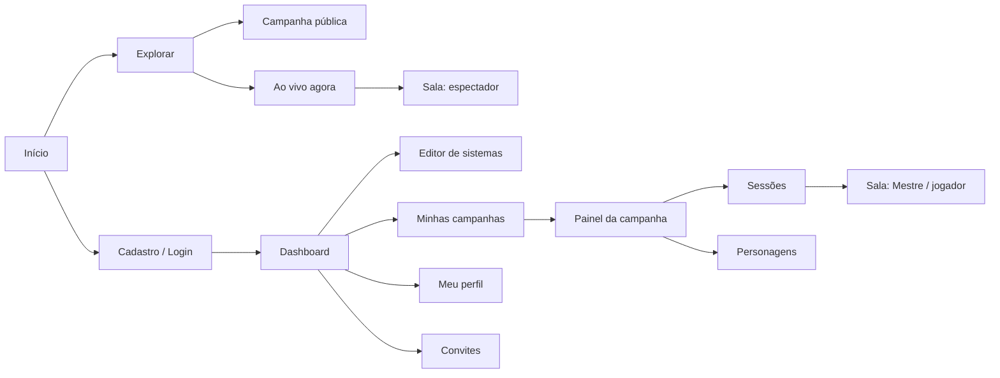

# 13 — Interface

## Sessões disponíveis

/sessoes lista agenda/histórico privados com busca, filtro e paginação. /campanhas/:id/sessoes mostra agenda da campanha; mestre cria em /nova. /sessoes/:id consulta estado e datas reais; /editar salva explicitamente, conserva rascunho em conflito e confirma descarte. Jogador consulta sem controles. Próximas sessões no início e Sessões da campanha mostram até três agendas/LIVE com Ver todas, também no celular.

/ao-vivo e /ao-vivo/:id são apresentação pública anônima, somente metadados, sem simular mesa ou audiência. Foco e 30 segundos enquanto visível reconsultam estado; encerramento/privatização limpa conteúdo público. Revogação limpa detalhes privados; erros oferecem nova tentativa. [Decisão 006](architecture/decisions/006-sessoes-e-agenda.md).

## Direção de experiência

A especificação funcional fornece exemplos de telas e organização. A [direção visual fornecida posteriormente](referencias/direcao-visual-original.md) define fantasia moderna, tema escuro, roxo e ciano, com Geist na interface. O [design system](19-design-system.md) registra os tokens adotados, a navegação implementada e os padrões das próximas telas.

O editor de sistema deve funcionar sem programação. A interface identifica contexto e papel do usuário: campanha atual, sistema, sessão e permissões. Ações indisponíveis devem ter explicação quando útil, mas a autorização continua sendo responsabilidade do servidor.

## Navegação proposta

Já implementado: `/sistemas` reúne meus sistemas e catálogo público com busca/paginação; `/sistemas/novo` cria uma definição; `/sistemas/:id/editar` permite ao autor editá-la; `/s/:id` apresenta sistemas públicos/não listados sem exigir login. A navegação autenticada tem Sistemas em desktop e celular. A prévia no editor acompanha os campos configurados, sem criar personagens.



## Telas do MVP 1

| Tela | Conteúdo | Ações e estados essenciais |
| --- | --- | --- |
| Início | Apresentação, campanhas públicas e sessões ao vivo | Explorar, cadastro e login; lista vazia sem números fictícios |
| Cadastro/login | Campos definidos em DP02 | Validação, envio, erro genérico de credenciais e sucesso |
| Dashboard | Minhas campanhas, próximas sessões, convites, personagens e sistemas | Criar conteúdo, aceitar convite, entrar na campanha; vazio/carregando/erro |
| Perfil | Nome, username, biografia, avatar | Titular edita; público vê projeção permitida |
| Catálogo de sistemas | Sistemas públicos e busca básica | Consultar detalhes; criador acessa seus privados em área própria |
| Editor de sistema | Nome, descrição, atributos, perícias, recursos e dados | Adicionar, ordenar, editar e remover campos; salvar e tratar definição inválida |
| Explorar campanhas | Campanhas públicas | Buscar/filtrar conforme dados existentes; privadas não aparecem |
| Detalhe de campanha | Apresentação, sistema, Mestre, status e conteúdo autorizado | Entrar como membro, administrar como Mestre; solicitar ingresso após MVP 1 |
| Painel do Mestre | Configuração, membros, convites, fichas e sessões | Editar campanha, gerenciar convites/jogadores, agendar/iniciar/encerrar |
| Ficha | Nome, imagem, descrição, atributos, perícias e recursos do sistema | Criar/editar conforme permissão; conflitos de edição e confirmação de persistência |
| Agenda/detalhe da sessão | Título, descrição, data/fuso, participantes, status e privacidade | Mestre administra; membro entra conforme estado |
| Sala da sessão | Participantes, fichas autorizadas, chat, dados e estado | Mensagem, rolagem e atualização permitidas; reconexão e encerramento visíveis |
| Ao vivo agora | Sessões públicas elegíveis, campanha, tema, Mestre e informações publicadas | Assistir; retirar sessão encerrada da lista |
| Sala do espectador | Projeção pública da sessão | Acompanhamento somente; sem comandos de ficha, dados ou administração |

Publicação básica de sistemas e visibilidade não listada já estão disponíveis conforme a [decisão 002](architecture/decisions/002-sistemas-versionados.md). Campanhas seguem as decisões [003](architecture/decisions/003-campanhas-versionadas.md) e [004](architecture/decisions/004-convites-e-membros.md): listagem com busca e abas próprias/públicas, criação com seleção paginada de sistemas, detalhe autorizado, edição e página pública de apresentação. O dashboard mostra até três campanhas próprias/com participação e três convites recentes. `/convites` oferece histórico paginado e aceite/recusa; a campanha mostra membros, ocupação e, ao mestre, envio/revogação/remoção. Jogadores têm consulta sem controles administrativos. A tela aberta verifica acesso ao recuperar foco e a cada 30 segundos enquanto visível. Sessões oferecem agenda e estado; chat, rolagens, mapas e combate são futuros. Fichas privadas seguem a [decisão 005](architecture/decisions/005-personagens-e-fichas.md): `/personagens` lista próprias, `/campanhas/:id/personagens` mostra próprias ao jogador/todas ao mestre, `/campanhas/:id/personagens/novo` cria e `/personagens/:id` consulta com edição em `/editar`. Valores usam campos da versão fixa; salvamento explícito, validação, rascunho preservado em conflito e confirmação para recarregar. Nível opcional. Remoção limpa a ficha aberta ao verificar acesso. No celular, a entrada global fica no card **Seus personagens** do início; a campanha oferece criação e lista. Não há dados fictícios nem controles de ingresso sem funcionalidade.

## Editor visual de sistema

Estrutura inicial baseada na seção 5:

```text
Informações gerais: nome e descrição
Dados: tipos habilitados
Atributos: lista de campos + adicionar
Perícias: lista de campos + adicionar
Recursos: lista de campos + adicionar
Visibilidade: conforme escopo de publicação
Salvar
```

Exemplos de rótulos: Força, Destreza, Inteligência, Vontade; Acrobacia, Investigação, Persuasão; Vida, Mana, Sanidade. São exemplos preenchidos pelo criador, e não valores obrigatórios.

O editor implementa validação de duplicatas, erros associados aos campos, remoção e ordenação por botões acessíveis e prévia da ficha. Salvar é uma ação explícita: mostra alterações pendentes, envio e versão confirmada. Conflito entre abas preserva a edição local e oferece carregar a versão salva mediante confirmação. Há aviso ao recarregar/fechar a página e ao seguir links no editor; voltar pelo histórico do navegador e sair da conta ainda podem descartar alterações sem esse aviso. Autosave e ordenação por arrastar ficam para uma etapa posterior.

## Campanha e painel do Mestre

Navegação completa prevista na origem:

| Área | Disponibilidade prevista |
| --- | --- |
| Visão geral, jogadores/convites, personagens, sessões e configurações | MVP 1 |
| NPCs, criaturas, itens e mapas | MVP 2; criaturas dependem da expansão do sistema |
| História estruturada, documentos e diário | MVP 3; descrição simples da campanha já existe no MVP 1 |

Durante a sessão, o painel futuro inclui mapa, combate, NPCs, jogadores, dados, notas, música e eventos. O MVP 1 concentra fichas, jogadores, chat e dados.

## Sala virtual

O layout completo da origem reserva área principal ao mapa/battlemap e áreas auxiliares para personagens, chat, dados, combate e iniciativa. Mapa, combate e iniciativa começam no MVP 2.

Proposta para MVP 1: área principal de fichas/participantes e painel de chat/dados. No celular, usar abas ou painéis recolhíveis, preservando enviar mensagem, rolar, consultar ficha e perceber desconexão.

Indicar sessão ao vivo, pausada ou finalizada com texto e sinal visual. Mostrar conexão/reconexão e não confirmar alterações antes do aceite do servidor. Erro de envio deve permitir repetir sem duplicar mensagem/rolagem.

Mensagem de rolagem pode mostrar expressão, resultados individuais, dados mantidos e total. Notas secretas e chat privado não são carregados no modo espectador.

## Explorar e recursos futuros

A origem prevê abas Ao vivo, Campanhas, Sistemas, Mestres e Criadores. Filtros: sistema, gênero, idioma, número de jogadores, recrutamento, classificação, popularidade, recentes e mais assistidas.

O MVP 1 cobre campanhas, sistemas conforme publicação adotada e sessões ao vivo. Listagem de Mestres/criadores, seguidores e rankings fica na etapa social. Solicitação de ingresso depende do fluxo posterior de aprovação.

Perfil completo futuro: banner, localização opcional, links, sistemas favoritos, campanhas, personagens, conquistas, seguidores e seguindo. Histórico de campanhas como Mestre/jogador, personagens, sistemas, horas e sessões exige regras de contagem; os números apresentados na origem são exemplos, não metas nem dados reais.

## Ferramentas da mesa nas etapas posteriores

| Área | Elementos descritos na origem | Etapa |
| --- | --- | --- |
| NPCs | Nome, imagem, descrição, atributos, habilidades, vida, inventário, comportamento e notas secretas; revelação pública, parcial ou secreta | MVP 2 |
| Inventário | Itens e quantidades, equipamentos e moedas; Mestre entrega e retira itens | MVP 2 |
| Combate | Lista de iniciativa, participantes, turno, vida e condições; adicionar/remover, mudar iniciativa e finalizar | MVP 2 |
| Mapas básicos | Upload de imagem, grid, zoom, movimentação e tokens | MVP 2, recorte fino a validar |
| Mapas avançados | Fog of war, iluminação, marcadores, áreas, medição de distância e integração com iniciativa | Fog of war no MVP 3; demais recursos com fase pendente |
| Ficha avançada | Inventário, equipamentos, habilidades, condições, história e anotações; campos dependem do sistema | Expansão junto dos módulos correspondentes |
| Documentos | História do reino, religiões, mapa político, facções, lendas e regras; audiência pública, jogadores, Mestre ou usuários específicos | MVP 3 |
| Diário | Registro de acontecimentos por sessão, com contexto e acesso autorizado | MVP 3 |
| Áudio e conteúdo | Música, efeitos e handouts disponibilizados pelo Mestre | MVP 3 |

A origem lista as funcionalidades de mapas como futuras, sem atribuir cada uma a um MVP. O recorte básico acima é proposta de organização. Fog of war deve representar visões distintas de Mestre e jogadores; a informação oculta não pode ser recuperada pelo payload do jogador.

## Estados e acessibilidade propostos

- Carregando, vazio, sucesso, erro de validação, erro de rede, conflito e acesso negado devem ter apresentação distinta.
- Navegação por teclado, foco visível, campos com rótulo e feedback de erro associado.
- Status não depende só de cor; ícones acionáveis têm nome acessível.
- Confirmar ações destrutivas na UI com contexto; confirmação não substitui autorização.
- Datas mostram fuso relevante; não assumir fuso do servidor.
- Dados em português na interface podem usar chaves técnicas estáveis sem acento no contrato.
- Sessão encerrada informa o estado e opções autorizadas de retorno/histórico.

## Decisões pendentes

DP07: defaults de edição da ficha. DP10: idiomas e classificação. DP11: conteúdo público da mesa, chat privado, anotações e chat de espectadores. Não há biblioteca de componentes ou wireframes definitivos aprovados.

## Referências

Origem: seções 5, 13–20, 22, 51–55. Veja [permissões](12-permissoes.md), [MVP](14-mvp.md) e [testes](16-testes.md).
